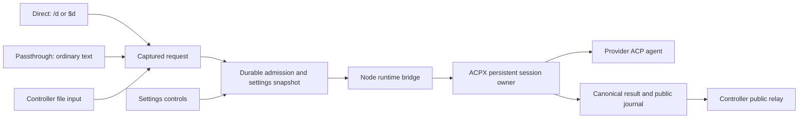

# ACPX implementation hardening — 2026-09-22

This is the core hardening checkpoint. Subsequent optional activity/usage
improvements and their current validation are documented in
[ACPX activity improvements](acpx-activity.md). The archive and counts below
describe the earlier core checkpoint.

This report covers the development worktree based on `main` at `cffecf7`
(v0.1.10). It is not a release or evidence that the installed Codex plugin has
been updated. Released archives under `dist` are preserved.

## Upstream comparison and architecture

The local comparison used OpenClaw `90e52dde` and ACPX `edb0db8`. Executable
integration tests use the installed npm **acpx@0.18.0**, not the newer ACPX source
checkout merely because it carries the same version. The installed runtime was
checked against the published 0.18.0 package during the comparison.

OpenClaw embeds `AcpxRuntime` from the public `acpx/runtime` entry point in its
persistent service. Its adapter adds host ownership, admission, configuration,
process leases and cleanup; ACPX owns the protocol and canonical turn result.
Relevant upstream files are `extensions/acpx/src/runtime.ts`,
`runtime-generations.ts`, `runtime-process-cleanup.ts`, and `service.ts`.

CLI-MODE's controller runs in separate invocations, so it uses the public
`createSharedAcpRuntime` API to join ACPX's persistent queue owner. A new bridge
process is a client of the retained session, not a new provider conversation.
This keeps CLI interoperability without introducing another persistent service.
The controller owns routing, durable receipts and admission; ACPX owns transport,
strict session resumption and completion. Direct is the default. Passthrough and
file input converge on the same request lifecycle.

Antigravity's explicit native-command handoff remains a separate transport under
the controller lifecycle, with a disclosed conversation change. It is not a
silent ACP resumption fallback.

## Changes and behavioral evidence

| Requirement | Implementation | Behavioral evidence |
| --- | --- | --- |
| One prompt lifecycle, Direct default | Hook capture, `send_request`, and file input admission | `test_captured_requests.py`, `test_modes.py`, real-runtime activation/mode test |
| Exact message forwarding and duplicate prevention | Temporary UTF-8 input, stable receipts, no reconstruction/replay | Unicode/CRLF, repeated receipt and concurrent submitter tests |
| Admission protects preflight through final metadata | Inflight operation exists before provider work; settings snapshots and rechecks | Concurrent settings, preflight cancellation and late metadata tests |
| Durable settings controls | Checkpoint before spawn; unknown responses retain inspectable custody | Six tests in `test_control_recovery.py`, including failed checkpoints and live shutdown |
| Provider conversation continuity | Native provider ID distinct from ACPX record ID; shared runtime strict resume | Changed-ID rejection, real idle expiry, missing-session and cold-reconfiguration tests |
| Authoritative completion | Canonical `turn.result`; no raw RPC/CLI exit-history completion logic | Recoverable terminal error, permission-denial recovery, canonical failure and owner-loss tests |
| Cancellation cannot disappear before admission | Durable cancel markers and runtime AbortSignal | Real-runtime gated bridge tests for both prompts and settings controls |
| Output recovery does not replay work | Request-filtered journal, complete-observation checks, cursor after log fsync | Artifact fidelity, invalid-cursor recovery, incomplete-output and owner-loss tests |
| Temporary input recovery respects ownership | Conversation-scoped cleanup around atomic state checkpoints | Orphan cleanup, failed capture/supersession and legacy uncertain receipt tests |
| Tested dependency cannot silently drift | Exact 0.18.0 check and saved absolute Node/package paths | Mismatched package rejection, pinned-path refresh and setup tests |
| Provider access rules survive shared transport | Adapter `validate_prompt` before preflight and actual launch | Actual-start spawn rejection for AGY, Cursor and Codex; provider adapter suites |
| Shutdown claims match evidence | Require absent open session; retain live submitters/failed closure | Cleanup, late control/prompt completion and concurrent closure tests |

The real-runtime fixture speaks ACP over stdio and persists synthetic provider
state. It needs no account, network service, paid model or user tools. Tests run
the actual pinned ACPX client/queue owner through the production bridge and
controller. Its owner-loss case terminates only its own synthetic queue owner.

## Validation

- Source suite: **413 tests passed** in 159.876 seconds. The subsequently added
  real-runtime control-cancellation test also passed independently.
- Final fresh-package suite: **414 tests passed**, **zero skips**, in 162.950
  seconds. This includes **14 tests using the actual pinned ACPX runtime**.
- Fresh extraction used an empty workspace and isolated Codex home/state. All
  **79 archive entries** match normalized current source bytes.
- Plugin validation, skill validation, Python compilation, Node syntax and
  `git diff --check` passed. Full-package LF/CRLF reproducibility is covered by
  the passing suite.
- Temporary development archive SHA256:
  `2f370ce3bc1f66479b796d843d3a29b9d294c9b54956d458010afd91dd402e0c`.
- Released `dist/cli-mode-0.1.10.zip` remains unchanged, SHA256
  `e126993e1b9dbfd43dc4b793d55f3914452670584d8ffb5e4a1c80787fed3152`.

[Machine-readable evidence](acpx-hardening-evidence.json) records exact upstream
commits, tested runtime versions, individual real-runtime cases, artifact location
and the full fresh-extraction evidence path. The temporary archive retains the
source manifest's version for development testing; it is not a published v0.1.10
replacement.

## Deliberate boundaries

- ACPX 0.18.0 shared sessions do not support injected `mcpServers`, per-turn
  permission callbacks, custom child-environment overlays or process-lifecycle
  callbacks. Nonempty ACPX MCP configuration is rejected before prompt submission;
  tools configured in the provider CLI are the supported path. A persistent
  embedded-runtime service would be needed for host-injected tools and interactive
  approval callbacks.
- Access uses the chosen static policy. A request needing unavailable interactive
  approval fails explicitly. User questions cannot be answered by granting a tool
  permission.
- `shutdownComplete` means recorded owned sessions are closed and local submitters
  have settled. `shutdownScope=owned-sessions` and `processTreeVerified=false`
  distinguish this from OpenClaw's process-lease/reaper guarantees. Provider-managed
  background tasks are not certified stopped.
- A failed response path can leave accepted work running. Receipts and operation
  IDs do not create provider-level exactly-once execution; inspect and reconcile
  uncertain work instead of automatically retrying it.
- Real provider accounts and installed Codex hook trust/loading are not exercised
  by this offline fixture or fresh-package extraction. Prior release live-provider
  reports describe their original snapshots, not this runtime change.
